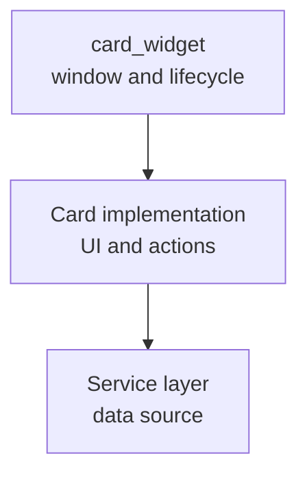

# PyQt6 Card Widget Framework

A cross-platform framework for building persistent, card-style desktop widgets with PyQt6. It provides window behavior and application lifecycle handling while each card owns its own UI, data source, and actions.

The framework is suitable for status displays, service controls, sensor readouts, media controls, notifications, and other focused desktop tools.

The framework targets Linux, macOS, and Windows through PyQt6's native platform backends. The core package has no platform-specific dependency. Linux-specific guidance in this document applies only to XWayland placement behavior and the Bluetooth example.

Released under the [MIT License](LICENSE).

PyQt6 is a separate dependency with its own GPL or commercial licensing terms. Review the PyQt6 license before distributing an application that uses this framework.

## Features

- Frameless, always-on-top, translucent card windows
- Top-right placement or explicit screen coordinates
- Dragging from the title area without interfering with card controls
- A shared close button and a `closing` signal for cleanup
- Reliable application shutdown from the close button or Ctrl+C
- Per-script JSON configuration for size and initial placement
- A small public API built on `QWidget`

## Requirements

- Python 3.10 or later
- PyQt6 6.5 or later
- A desktop session on Linux, macOS, or Windows

For cards that need explicit window placement under Linux Wayland, use XWayland and install the Qt `xcb` dependency when required:

```bash
sudo apt install libxcb-cursor0
```

The included examples run directly from a checkout with a system PyQt6 installation. The project also includes `pyproject.toml` for future package installation.



## Design Model

| Layer | Responsibility |
| --- | --- |
| `card_widget` | Window attributes, chrome, placement, dragging, and lifecycle helpers |
| Card implementation | Layout, presentation, user actions, and card-specific state |
| Service layer | Commands, devices, APIs, background work, and state notifications |
| Entry script | Card configuration and application startup |

This separation lets a service be reused by multiple card UIs and keeps framework concerns out of application-specific code.

## Quick Start

Subclass `BaseCardWidget`, add widgets to `content_layout`, and launch the card with `run_card()`. The runner exits cleanly when the user clicks the close button or presses Ctrl+C.

```python
from PyQt6 import QtWidgets

from card_widget import BaseCardWidget, run_card


class StatusCard(BaseCardWidget):
    def __init__(self) -> None:
        super().__init__("Status", width=220, height=140)
        self.content_layout.addWidget(QtWidgets.QLabel("Ready"))


raise SystemExit(run_card(StatusCard))
```

For cards that require explicit placement under Linux Wayland, set `QT_QPA_PLATFORM=xcb` before importing PyQt6 to run through XWayland. Do not set this variable on macOS or Windows.

```python
import os

os.environ.setdefault("QT_QPA_PLATFORM", "xcb")
```

## Framework API

- `BaseCardWidget(title, width, height, initial_position)`: frameless, always-on-top base card
- `content_layout`: `QVBoxLayout` for application-specific widgets
- `closing`: signal emitted before the card closes; use it to stop timers or services
- `move_to_initial_position()`: moves the card to its configured startup position
- `InitialPosition.TOP_RIGHT`: currently supported named position
- `run_card(card_factory, argv=None)`: single-card application runner with close-button and Ctrl+C support

See [card_widget/README.md](card_widget/README.md) for module-level details.

## Window Configuration

At startup, `run_card()` reads a JSON file from `~/config/pyqt6-cards/`. Its name is the executed Python filename without the extension. For example, running `./my_card.py` reads `~/config/pyqt6-cards/my_card.json`.

```json
{
  "width": 220,
  "height": 140,
  "position": {
    "x": 100,
    "y": 100
  }
}
```

Instead of coordinates, `position` can use the currently supported named position, `"top-right"`.

```json
{
  "width": 220,
  "height": 140,
  "position": "top-right"
}
```

Missing files, malformed JSON, and invalid values leave the card's code-defined defaults unchanged.

## Project Layout

```text
card_widget/           # Framework package
  base_card.py
  application.py
  settings.py

examples/              # Runnable reference implementations
  clock_card.py
  bluetooth_device/

templates/             # Starting points for new cards
  custom_card.py
  custom_card.json

tests/                 # Automated framework checks
```

The runnable scripts add the project root to their process-local import path, so examples work from a checkout without writing to site-packages. A distribution workflow can later use the root `pyproject.toml`.

## Development Checks

Run the included JSON configuration tests from the repository root:

```bash
QT_QPA_PLATFORM=offscreen python3 -m unittest discover -s tests -v
```

Build a wheel for local release testing without installing any Python package:

```bash
mkdir -p dist
python3 -m pip wheel --no-build-isolation --no-deps --wheel-dir dist .
```

`--no-build-isolation` uses the build tools already provided by the Python installation and avoids Debian/Ubuntu's externally managed environment restriction. The wheel is written to `dist/`. Test it in an isolated environment before publishing it.

## Examples

### Clock Card

[examples/clock_card.py](examples/clock_card.py) is a minimal card that updates a label with a timer.

```bash
./examples/clock_card.py
```

### Custom Card Template

[templates/custom_card.py](templates/custom_card.py) is a minimal starting point for a new card. Copy it, rename the class and title, then add content to `content_layout`. Its companion [settings template](templates/custom_card.json) keeps size and placement outside application code.

```bash
mkdir -p ~/config/pyqt6-cards
cp templates/custom_card.json ~/config/pyqt6-cards/my_card.json
```

### Bluetooth Device Dashboard

This is a Linux-only example because it depends on BlueZ `bluetoothctl`. It is not part of the cross-platform `card_widget` package.

The Bluetooth example monitors one device with a long-lived BlueZ `bluetoothctl` process. A reader thread parses live events and emits state updates to the Qt UI thread. The dashboard displays the device name, address, pairing state, and connection state.

It provides connect and disconnect actions, periodic resynchronization, and orderly cleanup of the subprocess and reader thread.

Set the device address in [examples/bluetooth_device/joycon_card.py](examples/bluetooth_device/joycon_card.py). This example requires `bluez`, `python3-pyqt6`, and, for XWayland, `libxcb-cursor0`.

## Design Principles

- **Framework first**: keep reusable desktop-window behavior in one place
- **Content agnostic**: do not constrain UI content or data sources
- **Small and independent**: each card can run and exit as its own application
- **Event driven**: prefer push-based state updates where practical
- **Cross-platform core**: rely on PyQt6 platform abstractions for Linux, macOS, and Windows
- **Platform-aware examples**: isolate Linux-specific XWayland and BlueZ guidance to the examples that need it
