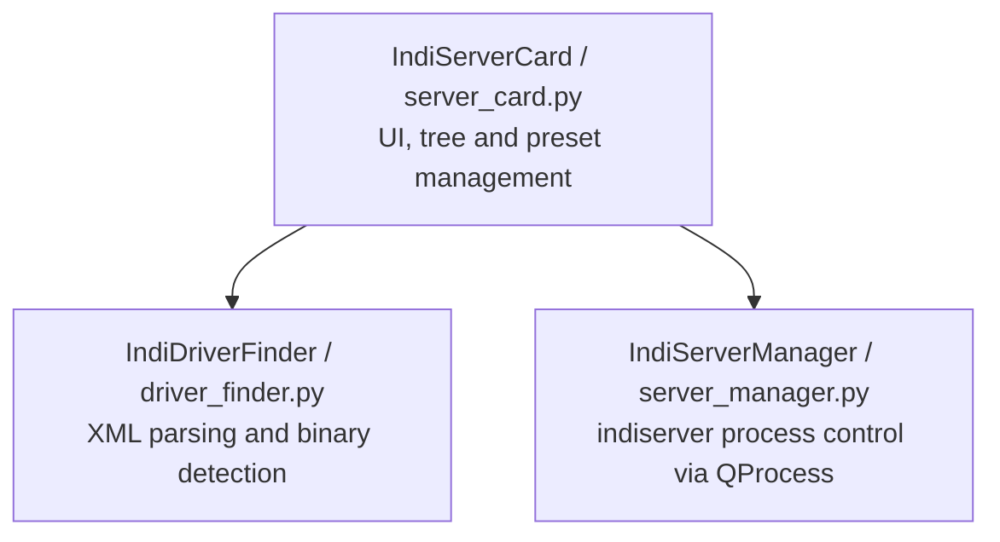

# INDI Server Control Card

A PyQt6 Card Widget for starting, stopping, and selecting drivers for the INDI (Instrument Neutral Distributed Interface) Server.

[日本語ドキュメント (Japanese Document)](README_ja.md)

## Design Specifications

### Overview
This card is a desktop widget designed to easily and flexibly manage and monitor `indiserver`, a control protocol server for astronomical equipment.

### Architecture

Following the framework's design principles, this component is separated into a Service Layer, a UI Layer, and a Data Discovery Layer.



#### 1. Data Discovery Layer (`driver_finder.py`)
- Searches for executable files matching `indi_*` in `/usr/bin/` (and across `PATH`).
- Parses `/usr/share/indi/drivers.xml` and individual `indi_*.xml` files.
- Extracts driver **binary name** (e.g., `indi_asi_ccd`), **friendly label** (e.g., `ZWO CCD`), **manufacturer** (e.g., `ZWO`), and **category/group** (e.g., `CCDs`, `Telescopes`), managing them in a hierarchical tree structure.
- Handles orphan `indi_*` binaries without XML definitions by assigning them to an `Uncategorized` group.

#### 2. Service Layer (`server_manager.py`)
- Manages `indiserver` execution in the background using `PyQt6.QtCore.QProcess`.
- Supports configurable port settings (default: `7624`) and additional options.
- Notifies state changes (Stopped, Running, Error, etc.) via the `status_changed` signal.
- Gracefully terminates the process (SIGTERM → timeout → SIGKILL) when receiving the widget's `closing` signal.

#### 3. UI Layer (`server_card.py`)
- Inherits from `BaseCardWidget` with a compact square design (`260x260` px).
- **Combined Start/Stop & Status Button**: Integrated status indicator button (`▶ Start Server`, `■ Stop Server`, `⏳ Starting...`, `⚠️ Error`) with color-coded feedback and port setting.
- **Preset Management**: Save, load, add, and delete driver selection patterns using `QComboBox`.
- **Categorized Tree View**: Uses `QTreeWidget` with checkable items grouped into 3-level hierarchy (Category -> Manufacturer -> Driver). Intermediate nodes support auto-tristate batch selection/deselection.
- **Real-time Filter**: Live search textbox for filtering driver labels and binary names.

---

## Presets Specification

Driver combinations can be saved as named presets for quick switching.

Default preset examples:
- `Simulators`: `indi_simulator_ccd`, `indi_simulator_telescope`, `indi_simulator_focuser`
- `ZWO Setup`: `indi_asi_ccd`, `indi_asi_focuser`, `indi_asi_wheel`, `indi_asi_rotator`
- `Custom`: Temporary unsaved selection state

---

## Usage

Run the card script directly from the repository root:

```bash
python3 examples/indi_server/server_card.py
```
