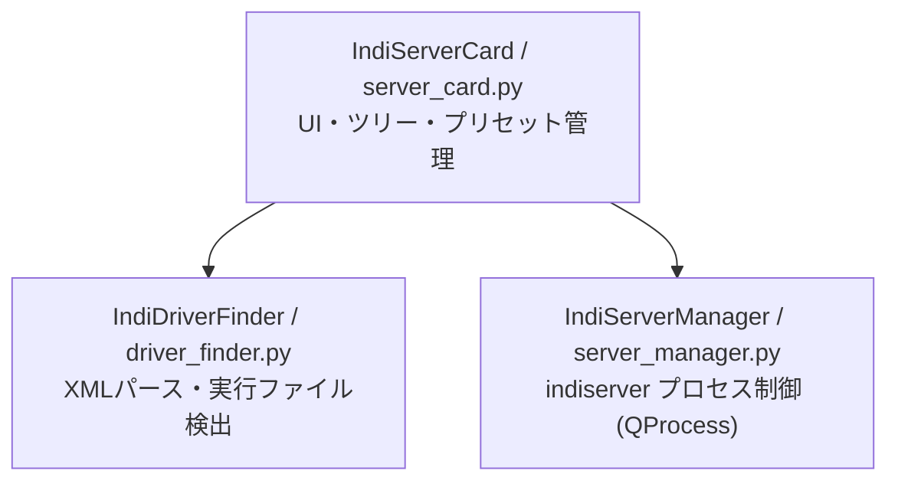

# INDI Server Control Card

INDI (Instrument Neutral Distributed Interface) Serverの起動・停止およびドライバ選択を行うPyQt6 Card Widgetです。

[English Document](README.md)

## 設計指針 (Design Specifications)

### 概要
本カードは、天体観測機器制御用のプロトコルサーバである `indiserver` をデスクトップ上で簡易かつ柔軟に管理・監視するためのカードウィジェットです。

### アーキテクチャ構成

本コンポーネントはフレームワークの設計思想に従い、Service層・UI層・データ探索層に分離されています。



#### 1. データ探索層 (`driver_finder.py`)
- `/usr/bin/indi_*` (および `PATH` 内の `indi_*`) の実行可能ファイルを検索。
- `/usr/share/indi/drivers.xml` および各 `indi_*.xml` をパース。
- ドライバの **バイナリ名**（例: `indi_asi_ccd`）、**フレンドリー名**（例: `ZWO CCD`）、**メーカー**（例: `ZWO`）、**カテゴリ/グループ**（例: `CCDs`, `Telescopes`）を抽出し、ツリー構造で管理。
- 同じバイナリを共有する機器別名（例: ZWO AM3、AM5、AM7）をすべて保持するため、機種名で検索可能。複数の別名を選んでも、サーバー起動時にはバイナリを一度だけ渡す。
- XMLが存在しない孤立した `indi_*` バイナリも `Uncategorized` グループに補完して認識。

#### 2. Service層 (`server_manager.py`)
- `PyQt6.QtCore.QProcess` を使用してバックグラウンドで `indiserver` を起動/管理。
- ポート番号設定（デフォルト: `7624`）や任意オプションの指定。
- サーバのステータス変化（停止中、起動中、エラー停止など）を `status_changed` シグナルで通知。
- ウィジェット終了時（`closing` シグナル受領時）にプロセスを安全かつ確実に終了 (SIGTERM → timeout → SIGKILL)。

#### 3. UI層 (`server_card.py`)
- `BaseCardWidget` を継承し、コンパクトな正方形サイズ (`260x260` px) でレイアウト。
- **統合型 起動/停止 & 状態表示ボタン**: 独立したラベルを廃止し、ボタン自体に記号・テキスト・色（`▶ Start Server`, `■ Stop Server`, `⏳ Starting...`, `⚠️ Error`）で状態表示と制御を集約。
- **プリセット管理**: `QComboBox` によるドライバ選択パターンの保存・読み込み・追加・削除。
- **カテゴリ・メーカー階層型ツリー**: `QTreeWidget` を使用し、3階層（カテゴリ -> メーカー/ブランド -> 個別ドライバ）で整理表示。親ノード選択による一括選択/解除（Auto-Tristate）に対応。
- **リアルタイム検索**: フィルタテキストボックスによるドライバ名/バイナリ名の絞り込み。

---

## プリセットの仕様

設定ファイル（`~/.config/pyqt6-cards/indi_server.json` または本カードの設定情報）に保存されます。

初期標準プリセット例:
- `Simulators`: `indi_simulator_ccd`, `indi_simulator_telescope`, `indi_simulator_focuser`
- `ZWO Setup`: `indi_asi_ccd`, `indi_asi_focuser`, `indi_asi_wheel`, `indi_asi_rotator`
- `Custom`: ユーザーが変更した際の一時状態

---

## 使用方法

```bash
python3 examples/indi_server/server_card.py
```
